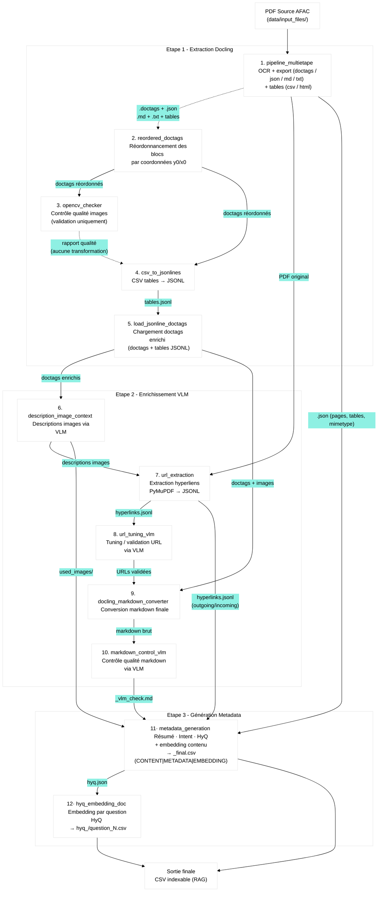

# Architecture du projet:
Diagramme global de l'architecture du pipeline d'extraction.

```mermaid
---
config:
  theme: 'base'
  themeVariables:
    primaryColor: '#FFF'
    primaryTextColor: '#000'
    lineColor: '#000'
    secondaryColor: '#8ef0e3ff'
---
flowchart TD
    PDF["PDF Source AFAC \n (data/input_files/)"]

    subgraph BASE["Etape 1 - Extraction Docling"]
        S01["1. pipeline_multietape \n OCR + export (doctags / json / md / txt) \n + tables (csv / html)"]
        S02["2. reordered_doctags \n Réordonnancement des blocs \n par coordonnées y0/x0"]
        S03["3. opencv_checker \n Contrôle qualité images \n (validation uniquement)"]
        S04["4. csv_to_jsonlines \n CSV tables → JSONL"]
        S05["5. load_jsonline_doctags \n Chargement doctags enrichi \n (doctags + tables JSONL)"]
    end

    subgraph VLM_TUNING["Etape 2 - Enrichissement VLM"]
        S06["6. description_image_context \n Descriptions images via VLM"]
        S07["7. url_extraction \n Extraction hyperliens \n PyMuPDF → JSONL"]
        S08["8. url_tuning_vlm \n Tuning / validation URL \n via VLM"]
        S09["9. docling_markdown_converter \n Conversion markdown finale"]
        S10["10. markdown_control_vlm \n Contrôle qualité markdown \n via VLM"]
    end

    subgraph METADATA["Etape 3 - Génération Metadata"]
        S11["11· metadata_generation \n Résumé · Intent · HyQ \n + embedding contenu \n → _final.csv (CONTENT|METADATA|EMBEDDING)"]
        S12["12· hyq_embedding_doc \n Embedding par question HyQ \n → hyq_<doc>/question_N.csv"]
    end

    OUT["Sortie finale \n CSV indexable (RAG)"]

    PDF --> S01
    S01 -.->|".doctags + .json \n .md + .txt + tables"| S02
    S02 -->|"doctags réordonnés"| S03
    S03 -.->|"rapport qualité \n (aucune transformation)"| S04
    S02 -->|"doctags réordonnés"| S04
    S04 -->|"tables.jsonl"| S05
    S05 -->|"doctags enrichis"| S06
    S06 -->|"descriptions images"| S07
    S01 -->|"PDF original"| S07
    S07 -->|"hyperlinks.jsonl"| S08
    S08 -->|"URLs validées"| S09
    S05 -->|"doctags + images"| S09
    S09 -->|"markdown brut"| S10
    S10 -->|"_vlm_check.md"| S11
    S01 -->|".json (pages, tables, mimetype)"| S11
    S07 -->|"hyperlinks.jsonl \n (outgoing/incoming)"| S11
    S06 -->|"used_images/"| S11
    S11 -->|"hyq.json"| S12
    S11 --> OUT
    S12 --> OUT
```